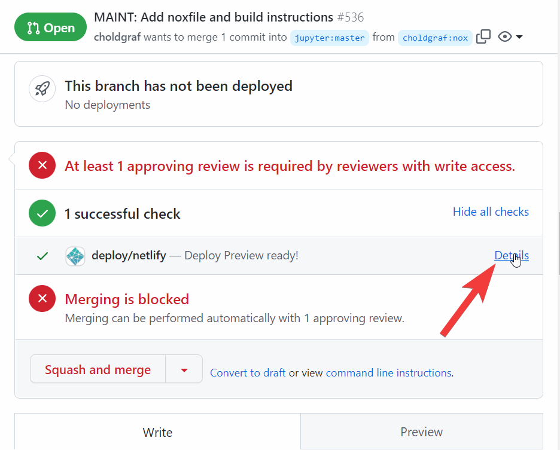

# Jupyter's main website

This is the source to [Jupyter.org](https://jupyter.org/).

## Build the site locally

The site is built with Jekyll, see [the Jekyll website](https://jekyllrb.com/) for how to customize the build process.

There are a few ways to build the site locally, see the sections below.

### Build the site automatically with `nox`

The easiest way to build the site locally is by using the [`nox` command line tool](https://nox.thea.codes/). This tool makes it easy to automate commands in a repository, and we have included a `build` command to quickly install the dependencies and build the site.

To build and preview the site locally, follow these steps:

1. **Clone this repository**.
   
   ```console
   $ git clone https://github.com/jupyter/jupyter.github.io
   $ cd jupyter.github.io
   ```
2. **Install `nox`**

   ```console
   $ pip install nox
   ```
3. **Run the `build` command**
   
   ```console
   $ nox -s build-live
   ```


This will install the needed dependencies in a virtual environment using [the `conda` package manager](https://docs.conda.io/en/latest/). 

**When the build is finished, go to `localhost:4000`**. When Jekyll finishes building your site, it will open a port on your computer and serve the website there so that you may preview it.

**You can make changes and watch the preview auto-update**. When you make changes to the website, they will automatically be updated in your preview in the browser.

To stop serving the website, press **`Ctrl`**-`C` in your terminal

### Build the site manually

To build the site manually, you'll need Ruby, Jekyll, and the packages that Jekyll uses to build the site (these are defined in [`Gemfile`](Gemfile)).

Follow these steps:

1. **Install Jekyll**. You have two options:
   - [Follow the Jekyll installation instructions](https://jekyllrb.com/docs/#instructions). These steps will guide you through installing Ruby and Jekyll locally.
   - Use [the anaconda distribution](https://conda.io) and [conda-forge](https://conda-forge.org/).

     First [install miniconda](https://conda.io/miniconda.html), then run the following command:

     ```console
     $ conda install -c conda-forge ruby c-compiler compilers cxx-compiler
     ```

     Finally install Jekyll and Bundler, which will let you install the site's dependencies:

     ```console
     $ gem install jekyll bundler
     ```
2. **Install the site's build dependencies**. These are specified in [`Gemfile`](Gemfile).
   
   ```console
   $ bundle install
   ```

   This step might take a few moments as it must download and install a number of local extensions. It will create a local file called `Gemfile.lock`. These are the "frozen" dependencies and their version numbers needed to build the site.

3. **Build the site locally**.
   
   ```console
   $ bundle exec jekyll serve liveserve
   ```

   This will build the site's HTML and open a server at `localhost:4000` for you to preview the site.


## Where the site is hosted

The site is automatically built with [Netlify](https://netlify.com), a hosting service for static websites. When any changes are merged into the `master` branch, Netlify will automatically build them and update the website at [jupyter.org](https://jupyter.org).

## Preview changes in a Pull Request

Netlify will automatically build a preview of the website in an open Pull Request. To see this, click on the **`Show all checks`** button just above the comment box in the Pull Request window. Then click on the **`details`** link on the **`deploy/netlify`** row to see a preview of the built site.

Here's an image of this box on a GitHub PR page:



## Structure of this website

Most pages are located at the place where their URL is, nothing fancy. Some are written in HTML. Others are written in Markdown. The homepage is in `index.html. The about page is in `about.md`.

## Create a new page

Create `my_page.html` (will have url `https://jupyter.org/my_page.html`)
or `my_page/index.html` (will have url `https://jupyter.org/my_page/`), start with the following:

```
---
layout: default
title: My Page
---

write some html here (consider you are already inside `<body></body>`)
```

You cannot do it yet with .md file, but you will be able soon.

Add commit (and don't forget to add to `_data/nav.yml`).

## Site quirks and tips

### SCSS variables

Shortcuts with colors and other common variables can be found in `_sass/settings`. They can be used in SCSS files.

```scss
@import "settings/colors"

a {
    color: $orange;
}
```

### Lazy loading of images

The Jupyter website uses [lazy loading of images](https://web.dev/browser-level-image-lazy-loading/). In general, images that are "below the fold" (below the browser window on page load) for laptop-sized screen sizes are encouraged to be configured for "lazy loading".

Add lazy loading to an image by adding a `loading="lazy"` configuration to the `` element. For example:

```html

```

For images that are "above the fold" (that will be seen by users immediately after page load), use "eager" loading to make sure they are loaded immediately. For example:

```html

```

### Automated quality checks

A workflow on GitHub Actions is run at every push and for every pull request to ensure basic integrity of the website:
- [validating](https://validator.w3.org/docs/help.html#validation_basics) the structure of the HTML using [Nu validator](https://validator.github.io/validator/) to ensure compliance with HTML standards
- checking linked URLs for errors (including expired certificates)
- running [Lighthouse](https://github.com/GoogleChrome/lighthouse) audits to ensure performance, accessibility, SEO optimization and best practices

If pre-defined quality targets are not met, the jobs will fail.
Click on "Details" link for the failing job to see what caused the failure.

The detailed results will be available in the logs (which are only shown to users logged in on GitHub),
including links to full Lighthouse reports on public temporary storage (the links will expire after 7 days).
